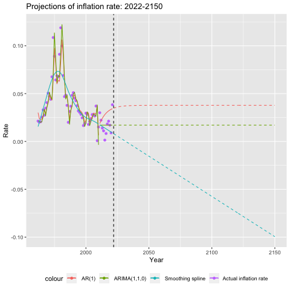
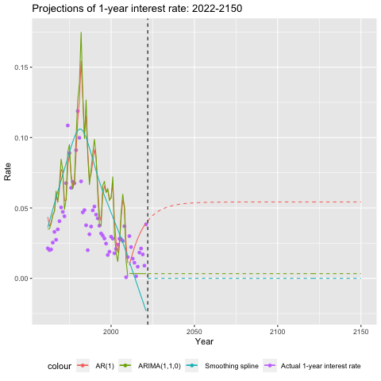
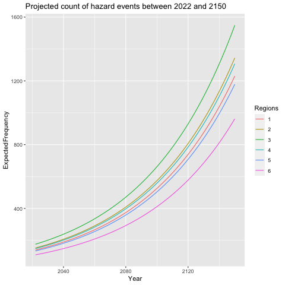
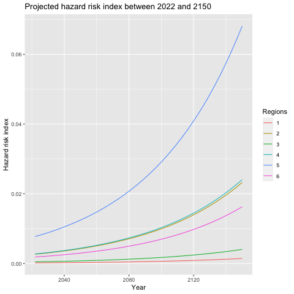

# 2023 SOA Case Study Challenge - A Relocation Social Insurance Program

<!--- 
 -->

<!--- _"Tell me and I forget. Teach me and I remember. Involve me and I learn" - Benjamin Franklin_

---

### Congrats on completing the [2023 SOA Research Challenge](https://www.soa.org/research/opportunities/2023-student-research-case-study-challenge/)!

>Now it's time to build your own website to showcase your work.  
>To create a website on GitHub Pages to showcase your work is very easy.

This is written in markdown language. 
>
* Click [link](https://classroom.github.com/a/elzutNYu) to accept your group assignment.

#### Follow the [guide doc](Doc1.pdf) to submit your work. 
---
>Be creative! Feel free to link to embed your [data](hazard-event-data.csv), [code](sample-data-clean.ipynb), [image](unsw.png) here

More information on GitHub Pages can be found [here](https://pages.github.com/)
 -->

## Executive summary
We aim to develop a social insurance program which can provide nationwide coverage against displacement due to natural perils in anticipation to the increasing frequency and severity of catastrophic climate events.

The product is designed to be accessible to all, tailored to meet the diverse geographical risks presented by Storslysia's six regions. In our design we focus on accurately forecasting future events so that Storslysia's residents may be relocated promptly, minimising potential costs associated with accommodation, lost of personal effects and psychological pressure. Based on our results, we have found that the relocation program could substantially reduce the economic cost of property damages over the long-term horizon. Additionally, we are 90.69% confident that the program cost will not exceed 10% of the national GDP in any given year by weighting different climate and macro-economic scenarios. 

## Program design

### Claim requirement & coverage

For citizens of Storslysia to submit a valid claim they must meet the following requirements: 
- The claim must be lodged within 6 months of the event which caused the loss.
- Policyholders cannot claim for a natural event which occurs within 72 hours of policy inception.
- The damage must not be a direct result of negligence to maintain the property or improper installation of pipes/circuitry/heaters etc.
- Any information disclosed must be full and truthful. This includes information about the extent of the damage, prior claims history and any other relevant facts[^1]. 

[^1]: Adjusters may decline the claim on the grounds of insufficient or false information.

The social insurance program will cover 50% of the cost for new property, and the rest will come from the owner or private insurance, as well as support for temporary housing. This ensures basic living for households, and low-income households can receive up to 1.5x the coverage. Below is a list of claim coverage, note that the amount is per household unless specified otherwise.

| Coverage Item | Coverage Amount |  Other Conditions |
| :--- | :--- | :---|
| New Housing | 50% (up to 150k) | Limits by region, based on mean price |
| Temporary Housing| up to 1,000/month | This is per person |
| Living Support| up to 3,000 | For low-income households[^2]|
| Moving Cost| up to 6,000 | For low-income households |

[^2]:Defined as households earning less than 50% of median income. 

### Voluntary relocation

Cost reduction benefits resulting from planned relocation can be categorised into two types:

- Relocation priorities and options: Geographical incentives are provided to affected parties to encourage  voluntary relocation, as a wider range of relocation alternatives and faster processing time are offered. This in turn lowers the urgency and need for transport and emergency aid, thus reducing unnecessary costs associated with involuntary relocation. 
- Cost Reduction and Additional Benefits: Households opting for voluntary relocation will have 80% coverage and limits for new housing, be provided with financial support in the form of free moving costs (of 4,000 $\varphi$ under Section 4.3.2) and additional relocation expenses coverage (of 2,000 $\varphi$ under Section 4.3.2) as well as supplementary support such as property/goods relocation services.

Through provision of these benefits we hope to incentivise a greater proportion of individuals at risk to act early to not only reduce costs but also to maintain public safety.  

### Program Timeframes
The model monitoring process will involve monthly reporting focusing on relocation costs and actions whereby every month there will be assessment of program progress and market conditions. Voluntary relocation options may be reduced if there is a labour shortage. Model performance will be reviewed annually and the parameters will be calibrated in line with the current years’ economic and climate data. In the case that actual experience deviates greatly from forecasts we may rebuild the economic and hazard models entirely to better predict aggregate cost. The past program costs and coverage will need to be analysed, inflation and GDP increase will also need to be reflected in coverage amounts and excess limits.

In the long run, every ten years the model will undergo a major overhaul. As climate events be- come increasingly unpredictable globally, new findings will be used to rebuild the technical cost model. Emerging technologies will also help to improve costs and efficiency. Detailed list is as below:

| Timeframe | Actions |  Other Changes |
| :--- | :--- | :---|
| 1 Month | Monitor property and construction market   Monitor current year's program costs   Adjust relocation schedules | National Economic Figures Property/Industry Reports |
| 1 Year | Annual assessment of program costs/coverage   Update Hazard Model   Update Economic Model   Update program coverage limits/amount | National Economic Figures   Legal and Policy Change   World Economic Outlook   Climate Change Report |
| 10 Years | Review program coverage/past results   Update/Rebuild Economic Model   Update/Rebuild Hazard Model | Major Climate Events   Tech Improvement |

## Macro-economic, hazard and damage modelling

### Macro-economic variables modelling: 

To take account into the effects of inflation and interest rates on property value and damage data, we build a time-series model to project the future inflation. For model selection, we split the historical inflation rates and interest rates into a training period (before Year 2010) and the validation period (after Year 2010). The model with the lowest validation Mean-Square-Error, which is ARIMA(1,1,0), is chosen as our best estimate for future inflaiton rates and interest rates. The other two models, namely AR(1) and the smoothing spline, are used to form our upper scenario (i.e., high inflation rate) and the lower scenario (i.e., low inflation rate), respecitvely. 

The projections of future inflation rates and interest rates are shown in the following two figures:  

Projection of inflation rates          |  Projection of interest rates
:-------------------------:|:-------------------------:
  |  

### Hazard and damage modelling:

Frequency and severity of hazard loss have been modelled separately in our analysis. We have taken a standard approach and used Poisson regression to model hazard frequency since the count of hazard events is a discrete random variable. In particular we chose a Poisson GAM as it outper-
formed the Poisson GLM with regards to AIC and BIC metrics.

For severity model we chose to model the damage ratio (the ratio of property damage to exposure) instead of the absolute value of property damage, as dollar value of property damage could be heavily influenced by the market value of the property rather than the inherent severity of the
peril. To model the damage we fit a zero adjusted Beta distribution as the damage ratio varies between 0 and 1 and the distribution is highly non-symmetric. 

The fitted frequency and damage models specified above are used to generate projections for future hazard events count and damage ratio. As per the figure below, Region 3 has the highest projected events count. To factor both frequency and severity into risk evaluation, we have developed a climate risk index, defined as the product of predicted events count and the damage ratio. Based on the climate risk index, Region 5 has the highest risk in all projected years.

Projected hazard events count          |  Projected climate risk index
:-------------------------:|:-------------------------:
  |  

## Pricing and cost

## Risk and Risk mitigation

## Conclusion

