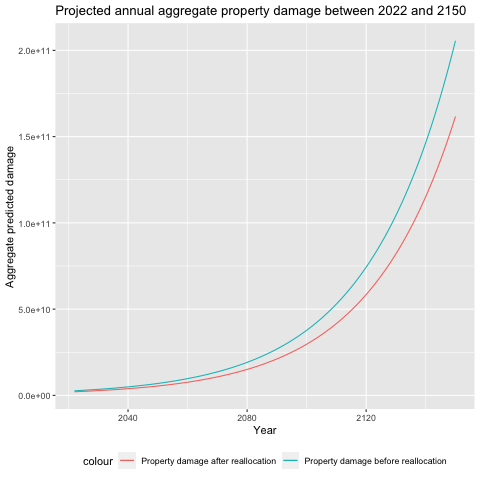
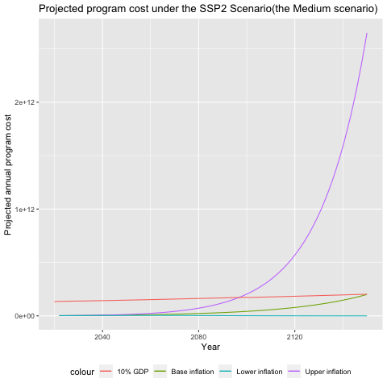

# 2023 SOA Case Study Challenge - A Relocation Social Insurance Program

<!--- 
 -->

<!--- _"Tell me and I forget. Teach me and I remember. Involve me and I learn" - Benjamin Franklin_

---

### Congrats on completing the [2023 SOA Research Challenge](https://www.soa.org/research/opportunities/2023-student-research-case-study-challenge/)!

>Now it's time to build your own website to showcase your work.  
>To create a website on GitHub Pages to showcase your work is very easy.

This is written in markdown language. 
>
* Click [link](https://classroom.github.com/a/elzutNYu) to accept your group assignment.

#### Follow the [guide doc](Doc1.pdf) to submit your work. 
---
>Be creative! Feel free to link to embed your [data](hazard-event-data.csv), [code](sample-data-clean.ipynb), [image](unsw.png) here

More information on GitHub Pages can be found [here](https://pages.github.com/)
 -->

  
   

---

## Executive summary
We aim to develop a social insurance program which can provide nationwide coverage against displacement due to natural perils in anticipation to the increasing frequency and severity of catastrophic climate events.

The product is designed to be accessible to all, tailored to meet the diverse geographical risks presented by Storslysia's six regions. In our design we focus on accurately forecasting future events so that Storslysia's residents may be relocated promptly, minimising potential costs associated with accommodation, lost of personal effects and psychological pressure. Based on our results, we have found that the relocation program could substantially reduce the economic cost of property damages over the long-term horizon. Additionally, we are 90.69% confident that the program cost will not exceed 10% of the national GDP in any given year by weighting different climate and macro-economic scenarios. 

## Program design

### Claim requirement & coverage

For citizens of Storslysia to submit a valid claim they must meet the following requirements: 
- The claim must be lodged within 6 months of the event which caused the loss.
- Policyholders cannot claim for a natural event which occurs within 72 hours of policy inception.
- The damage must not be a direct result of negligence to maintain the property or improper installation of pipes/circuitry/heaters etc.
- Any information disclosed must be full and truthful. This includes information about the extent of the damage, prior claims history and any other relevant facts[^1]. 

[^1]: Adjusters may decline the claim on the grounds of insufficient or false information.

The social insurance program will cover 50% of the cost for new property, and the rest will come from the owner or private insurance, as well as support for temporary housing. This ensures basic living for households, and low-income households can receive up to 1.5x the coverage. Below is a list of claim coverage, note that the amount is per household unless specified otherwise.

| Coverage Item | Coverage Amount |  Other Conditions |
| :--- | :--- | :---|
| New Housing | 50% (up to 150k) | Limits by region, based on mean price |
| Temporary Housing| up to 1,000/month | This is per person |
| Living Support| up to 3,000 | For low-income households[^2]|
| Moving Cost| up to 6,000 | For low-income households |

[^2]:Defined as households earning less than 50% of median income. 

### Voluntary relocation

Cost reduction benefits resulting from planned relocation can be categorised into two types:

- Relocation priorities and options: Geographical incentives are provided to affected parties to encourage  voluntary relocation, as a wider range of relocation alternatives and faster processing time are offered. This in turn lowers the urgency and need for transport and emergency aid, thus reducing unnecessary costs associated with involuntary relocation. 
- Cost Reduction and Additional Benefits: Households opting for voluntary relocation will have 80% coverage and limits for new housing, be provided with financial support in the form of free moving costs (of Ꝕ4,000) and additional relocation expenses coverage (of Ꝕ2,000) as well as supplementary support such as property/goods relocation services.

Through provision of these benefits we hope to incentivise a greater proportion of individuals at risk to act early to not only reduce costs but also to maintain public safety.  

### Program timeframes
The model monitoring process will involve monthly reporting focusing on relocation costs and actions whereby every month there will be assessment of program progress and market conditions. Voluntary relocation options may be reduced if there is a labour shortage. Model performance will be reviewed annually and the parameters will be calibrated in line with the current years’ economic and climate data. In the case that actual experience deviates greatly from forecasts we may rebuild the economic and hazard models entirely to better predict aggregate cost. The past program costs and coverage will need to be analysed, inflation and GDP increase will also need to be reflected in coverage amounts and excess limits.

In the long run, every ten years the model will undergo a major overhaul. As climate events be- come increasingly unpredictable globally, new findings will be used to rebuild the technical cost model. Emerging technologies will also help to improve costs and efficiency. Detailed list is as below:

| Timeframe | Actions |  Other Changes |
| :--- | :--- | :---|
| 1 Month | Monitor property and construction market   Monitor current year's program costs   Adjust relocation schedules | National Economic Figures Property/Industry Reports |
| 1 Year | Annual assessment of program costs/coverage   Update Hazard Model   Update Economic Model   Update program coverage limits/amount | National Economic Figures   Legal and Policy Change   World Economic Outlook   Climate Change Report |
| 10 Years | Review program coverage/past results   Update/Rebuild Economic Model   Update/Rebuild Hazard Model | Major Climate Events   Tech Improvement |

## Macro-economic, hazard and damage modelling

### Macro-economic variables modelling: 

Historical values of inflation and interest rates are provided, and used to construct time-series model to project the future inflation/gdp growth. These values are used to make prediction on property value/damage, gdp and prices of goods and services. Then the projections are adjusted under 4 different emission scenarios, and taking weight average approach for estimates and also extreme scenarios for risk tests.

For model selection, we split the historical inflation rates and interest rates into a training period (before Year 2010) and the validation period (after Year 2010). The model with the lowest validation Mean-Square-Error, which is ARIMA(1,1,0), is chosen as our best estimate for future inflaiton rates and interest rates. The other two models, namely AR(1) and the smoothing spline, are used to form our upper scenario (i.e., high inflation rate) and the lower scenario (i.e., low inflation rate), respecitvely. 

The projections of future inflation rates and interest rates are shown in the following two figures:  

Projection of inflation rates          |  Projection of interest rates
:-------------------------:|:-------------------------:
  |  

### Hazard and damage modelling:

Frequency and severity of hazard loss have been modelled separately in our analysis. We have taken a standard approach and used Poisson regression to model hazard frequency since the count of hazard events is a discrete random variable. In particular we chose a Poisson GAM as it outper-
formed the Poisson GLM with regards to AIC and BIC metrics, which is shown below. 

| Model        | AIC      | BIC      |
|--------------|----------|----------|
| Poisson GLM  | 8547.482 | 8680.895 |
| Poisson GAM  | 8396.522 | 8529.935 |

For severity model we chose to model the damage ratio (the ratio of property damage to exposure) instead of the absolute value of property damage, as dollar value of property damage could be heavily influenced by the market value of the property rather than the inherent severity of the
peril. To model the damage we fit a zero adjusted Beta distribution as the damage ratio varies between 0 and 1 and the distribution is highly non-symmetric

The fitted frequency and damage models specified above are used to generate projections for future hazard events count and damage ratio. As per the figure below, Region 3 has the highest projected events count. To factor both frequency and severity into risk evaluation, we have developed a climate risk index, defined as the product of predicted events count and the damage ratio. Based on the climate risk index, Region 5 has the highest risk in all projected years.

Projected hazard events count          |  Projected climate risk index
:-------------------------:|:-------------------------:
  |  

The detailed development steps for the macro-economic models and the hazard models can be found in the Appendix section of the main report [here](ACTL5100_Assignment_Final_GroupClimateDynamics.pdf)

## Pricing and cost

Based on the results above, Region 5 is deemed to have the highest risk, while Region 1 has the lowest risk. As a result, our program aims to relocate residents from Region 5 to Region 1.

To calculate the potential economic impact of the relocation program, we assume that all residents from Region 5 are successfully relocated to Region 1. The increase in the exposure in Region 1 will be the cost of constructing new houses to accommodate immigrants from Region 5, which could be approximated as: $\tilde{E}_5=H_5\cdot\bar{V}_1$, where $H_i$ is the number of households in region $i$ and $\bar{V}_i$ as the mean housing value in region $i$. We further assume the climate risk in Region 1 stays the same after relocation (i.e., the expected frequency $\hat{N}_1$ and the expected damage ratio $\hat{d}_1$ stay the same), then the new total property damage in Region 1 after relocation will be: $\tilde{D}_1 = (E_1+\tilde{E}_5)\times \hat{d}_1 \times \hat{N}_1$. And the new total property damage in Region 5 will be zero (i.e., $\tilde{D}_5=0$) as we assume all the residents in Region 5 will move to Region 1.

The projected property damage with and without relocation are shown in Figure 1, under the baseline inflation scenario. The difference between the projected property damage becomes more significant in later projected years, which might be explained by the quadratic growth of hazards frequency and the accumulation effects of inflation rates.   

  
    
  <em>Figure 1: Property damage before/after relocation.</em>

Additionally, we have also calculated the present value of expected cost saving from the reduction in projected property damage after the relocation during the next **10-year horizon**. The present value of the total expected cost saving is **Ꝕ6,566,773,052.43**.

### Relocation Costs

The table below lists the costs associated with relocation for the year 2020, using the values for Region 1 as an example. Please note that these figures will be updated annually based on inflation and the respective rates for the upcoming year. Additionally, the potential cost savings from voluntary relocation are more than 3 times the median household income.

| Related Items | Cost(Ꝕ) |  Estimation Method | Avoidable? |
| :--- | :--- | :---| :---|
| New Property Cost | 371,828 | Property value distribution | No |
| -Additional Construction | 111,939 | 50% of construction costs[^3] | Yes |
| Replacing Household Goods | 124,272 | 60% of housing costs | Yes |
| Temporary Housing | 44,064 | | Yes |
| Moving Costs | 4,000 | Industrial averages for USA states | No |
| -Additional Moving Costs | 2,000 | 50% of normal costs | Yes |
| **Avoidable Total** | **282,275** | |

[^3]: Cost estimated using industrial averages for USA states [link](https://www.forbes.com/home-improvement/contractor/cost-to-build-a-house/)

To factor the initial investment in relocation cost into program cost consideration, we have projected the Net Present Value (NPV) of the relocation project up to the year 2150, with a break-even point in year 2088. Although the payback period of the project is relatively long due to the large initial relocation investment, the cost saving is substantial in the long term due to the quadratic increasing trend.

## Assumptions

### Economic Projection

Due to incompleteness of information, assumptions are made to create forecasts for some of Storslysia’s economic figures:
*	Property prices increase/decrease according to inflation rate
*	GDP growth follows same pattern as the bank's 1-year lending rate
* Regional housing prices are calculated under per capita
These figures are subjective to various social economic factors including global economy and government intervention etc, and in long term can lead to large difference with real figures.

### Emission Scenarios

We have made assumption that Storslysia’s economy will be affected similar to the global GDP growth forecast under the 4 different emission scenarios. The model predictions are adjusted to reflect emission scenarios individually and calculated the weighted outcome after assigning a weight to each scenario. Different areas in the world will be affected by climate change differently, for example for a coastal region will be heavily impacted by rising sea level (flooding or even permanent inundation) from high emission [8]. If Storslysia is a island country or large amount of economic activities based in coastal region, it won’t likely to have highest GDP growth in SSP5-baselines emission scenarios.

  
    
  <em>Figure 3: Emission Scenarios.</em>

### Timeliness of Quantitative Analysis
The quantitative models are strongly influenced by the past trend and we have assumed a similar long term trend (Refer to Figure 1 for historical inflation and interest rates). However macroeconomic related forecasts (GDP, inflation etc.) are heavily affected by various drivers including global trade, commodity prices and government monetary policies, and should not be relied on long term \cite{economicforecastaccuracy}. This means that the long time frame (10years) prediction of the model will have high uncertainties, and the model should be constantly adjusted each year to stay accurate and up to date.

## Risk and Risk mitigation

There are two primary categories of risks: quantifiable risks and qualitative risks. The table below presents examples of each type.

| Qualitative Risks | Quantifiable Risks | 
| :--- | :-------------------------------- | 
| **Availability of new properties:** The availability of new properties can be affected by many factors including limited labour, resources, build permits issued (Region 3 permits issued is only 0.32% of properties), which will be a great issue in events of major hazard events. Voluntary relocation is a big part of mitigation, distributing relocation evenly in advance to ease the peak demand, and government can initiate development projects to build relocation properties in mass. | **Catastrophic Hazard Events:** Large flooding and earthquakes can cause thousands of households to force to relocate. Such events are very hard to forecast but becoming more common with climate change. We have modelled the worst scenario and tested the sustainability of program under stress, and there is a very large increase in severity of damage. |
| **Disruption of Work:** Hazard events can cause damage to commercial properties and affect business activities as well, causing people to lose their job temporarily or permanently. In the program plan there will be loss of income help to households with income below a threshold, to help households in poverty or lost income for the duration of relocation. | **Macro-economic variables:** The inflation rate and interest rates could deviate from the baseline assumptions due to policy changes or external shock to the system. To assess the risk from changing macro-economic environment, we have projected the program cost under the high-inflation scenario, the baseline inflation scenario, and a low inflation scenario. | 

To assess the sensitivity of our projected program cost, we have performed a scenario analysis of the program cost under different climate change and macroeconomic scenarios. The projections of program cost under the SSP 1 scenario (i.e., the most optimistic scenario regarding to CO2 emission), the SSP 2 scenario (i.e., the medium pathway), and the SSP 5 scenario (i.e., the most pessimistic scenario regarding to CO2 emission), are shown below. 

Projected cost under SSP1 (best scenario)          |  Projected cost under SSP2 (medium scenario) | Projected cost under SSP5 (worst scenario)
:-------------------------:|:-------------------------:|:-------------------------:
  |   | 

Under the SSP 1 scenario, the projected program cost under the baseline inflation scenario does not surpass the 10% of national GDP (marked by the red line) in any given year. As for the SSP 2 emission scenario, the projected program cost only reaches the 10% of GDP at the end of the year 2150. However, under the high emission scenario (i.e., SSP 5), the program cost is expected to surpass the 10% of GDP in the middle of the forecasting horizon. This result highlights the view that the increasing damage caused by the high CO2 emission cannot be justified by the fast economic growth.

The proportion of times that the projected program cost will exceed the 10% of national GDP under each combination of climate and macro-economic scenarios is shown in the table below (under the column ProportionSurpass). Our confidence level that the 10% of GDP constraint will not be surpassed is then one minus the exceeding proportion. As per the table, our confidence level decreases when either the inflation rate or CO2 emission is high. 

Additionally, we have weighted each climate and macro-economic scenario to derive the weighted confidence, where the weights are determined judgmentally to reflect our perceptions of future environment. Our final confidence level is then a weighted average of the confidence level under different scenarios, which is **90.69%**. 

| Climate Scenario | Economic Scenario | Proportion Surpass | Confidence Level | Weight (Climate) | Weight (inflation) | Weighted confidence |
|-----------------|------------------|-------------------|-----------------|------------------|--------------------|-------------|
| SSP1            | Lower            | 0.00%             | 100.00%         | 10.00%           | 10.00%             | 1.00%       |
| SSP1            | Base             | 0.00%             | 100.00%         | 10.00%           | 80.00%             | 8.00%       |
| SSP1            | Upper            | 37.21%            | 62.79%          | 10.00%           | 10.00%             | 0.63%       |
| SSP2            | Lower            | 0.00%             | 100.00%         | 70.00%           | 10.00%             | 7.00%       |
| SSP2            | Base             | 0.00%             | 100.00%         | 70.00%           | 80.00%             | 56.00%      |
| SSP2            | Upper            | 41.86%            | 58.14%          | 70.00%           | 10.00%             | 4.07%       |
| SSP3            | Lower            | 0.00%             | 100.00%         | 10.00%           | 10.00%             | 1.00%       |
| SSP3            | Base             | 20.93%            | 79.07%          | 10.00%           | 80.00%             | 6.33%       |
| SSP3            | Upper            | 48.06%            | 51.94%          | 10.00%           | 10.00%             | 0.52%       |
| SSP5            | Lower            | 0.00%             | 100.00%         | 10.00%           | 10.00%             | 1.00%       |
| SSP5            | Base             | 41.09%            | 58.91%          | 10.00%           | 80.00%             | 4.71%       |
| SSP5            | Upper            | 56.59%            | 43.41%          | 10.00%           | 10.00%             | 0.43%       |

## Data Limitatiohn and Improvements

### Economic Modelling
And as only only GDP figures from 2019-2021 are present, the 1 year lending rate are used to predict GDP growth. Having access to historical GDP can help improve the prediction accuracy. And similarly there is no access to historical property prices and construction costs, whilst inflation can be a decent method to estimate price change, they do not always align, for example investment can drive land and property prices up much faster than inflation. Having access to historical data for key affected sectors will improve accuracy of model prediction.

### Cost Estimation through Other Sources
There are various costs/figures that are estimated through other sources, the estimation are done individually for the 6 regions and come from USA states with comparable GDP per-capita, that the currency has been converted to Storslysia currency when comparing and using the numbers. The list of estimated costs include

*	Construction cost of dwellings
*	Time taken to construct dwellings
*	Lifespan of household goods
* Cost of moving home

For data estimated from other sources, these might not be a very accurate reflection of Storslysia, and can lead to large errors over long time. To gain these numbers and improve on accuracy of predictions, will require research into Storslysia's government or private reports and studies, and if not available yet then arrange studies and surveys into these figures. 

### Hazard and Damage Modelling

In this project, we only have access to regional level hazard information. Given that high resolution data is not available, our estimation of property damage could carry substantial uncertainty. For instance, the elevation and structures of individual property could cause significant variation in the actual damage ratio among different properties for flooding events. If damage data with finer resolution is collected in future, we could incorporate more granular information into our modelling to reduce the uncertainty involved. 

## Bibliography

[1] Rachel Abraham & Samantha Allen (2022): How Much Does It Cost To Build A House In 2023? Available
at https://www.forbes.com/home-improvement/contractor/cost-to-build-a-house/.

[2] Marcus C Christiansen & Andreas Niemeyer (2014): Fundamental definition of the solvency capital re-
quirement in solvency II. ASTIN Bulletin: The Journal of the IAA 44(3), pp. 501–533.

[3] Chamindi Malalgoda, Dilanthi Amaratunga & Richard Haigh (2014): Challenges in creating a disaster
resilient built environment. Procedia Economics and Finance 18, pp. 736–744.

[4] Heather McGrath, Ahmad Abo El Ezz & Miroslav Nastev (2019): Probabilistic depth–damage curves for
assessment of flood-induced building losses. Natural Hazards 97, pp. 1–14.

[5] Bruno Merz, Heidi Kreibich, Reimund Schwarze & Annegret Thieken (2010): Review article" Assessment
of economic flood damage". Natural Hazards and Earth System Sciences 10(8), pp. 1697–1724.

[6] Masayuki Morikawa (2020): The accuracy of long-term growth forecasts by
economics researchers. Available at https://cepr.org/voxeu/columns/
accuracy-long-term-growth-forecasts-economics-researchers.

[7] PROPERTY REGISTRY TEAM (2022): How long does it take to build a house in 2022? Available at https:
//propertyregistry.com.au/how-long-does-it-take-to-build-a-house/.

[8] UCAR: Climate Change: Regional Impacts. Available at https://scied.ucar.edu/learning-zone/
climate-change-impacts/regional.

